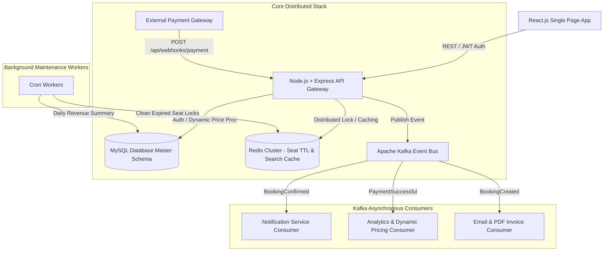
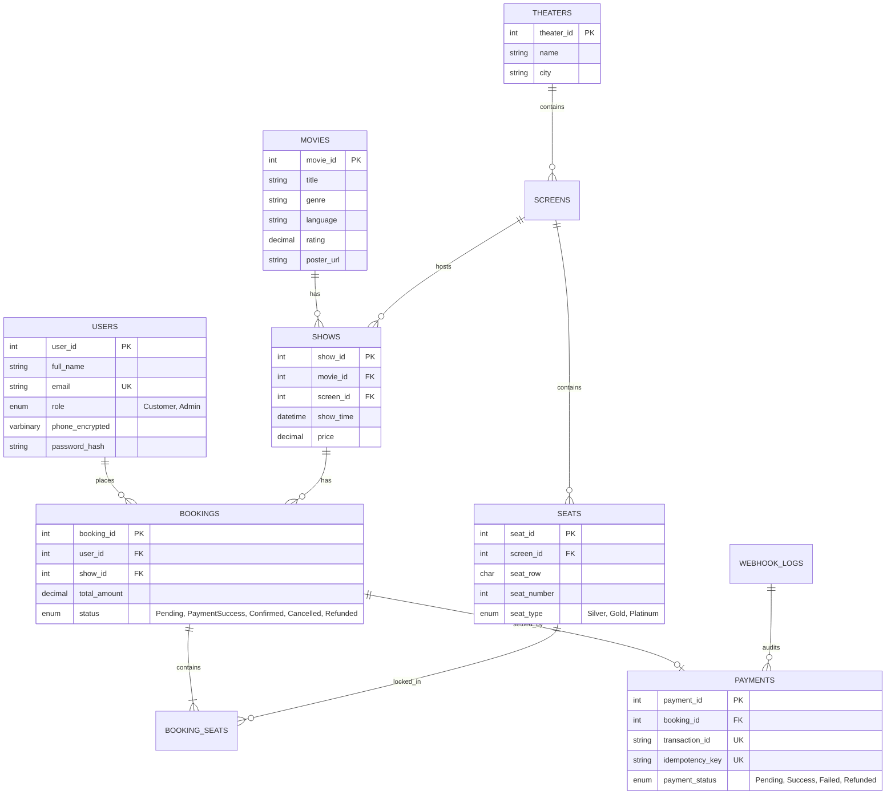

# CineWave - Distributed Movie Ticket Booking & High-Concurrency Engine

[](https://github.com/Prudhvi-2412/Movie-Ticket-Booking/actions)
[](docker-compose.yml)
[](backend/package.json)
[](backend/src/redis/seatLock.js)
[](backend/src/kafka/producer.js)
[](MovieBookingSystem/Schema/tables.sql)

CineWave is an industry-grade, full-stack distributed backend system modeled after high-concurrency event-driven architectures such as **BookMyShow**. Built upon a normalized, partitioned MySQL relational database foundation, the system adds real-time Redis distributed seat locking, an Apache Kafka event bus, payment webhook idempotency processing, dynamic pricing stored procedures, and Prometheus metrics monitoring.

---

## 🏛️ System Architecture



---

## 🗄️ Database ER Diagram & Relational Schema

The database features normalized (1NF, 2NF, 3NF) tables with range partitioning on `bookings` by `YEAR(booking_time)` for scalable historical querying.



---

## 🚀 Key Architectural Features

### 1. Distributed Seat Locking System (Redis TTL)
- **Problem**: When hundreds of users simultaneously attempt to book seat `Row A, Seat 5` for a blockbuster premiere, database row locks create lock escalation bottlenecks or cause double bookings.
- **Solution**:
  - Redis key pattern: `seat_lock:<show_id>:<seat_id>` with a 600-second (10-minute) TTL.
  - Multi-seat atomic lock acquisition via atomic Lua pipeline / SET NX EX.
  - If any single seat in a multi-seat selection is currently held by another user, the batch is atomically rolled back, preventing partial seat holds.
  - Seats automatically expire and unlock after 10 minutes if payment is abandoned.

### 2. Kafka Event-Driven Architecture
- **Topics**: `booking-events`
- **Events**: `BookingCreated`, `PaymentSuccessful`, `BookingConfirmed`, `BookingCancelled`, `SeatReleased`
- **Decoupled Consumers**:
  - **Notification Consumer**: Instant SMS & App Push notifications.
  - **Analytics Consumer**: Tracks occupancy rates and automatically invokes the MySQL stored procedure `UpdateDynamicPrice` when show occupancy exceeds 80%.
  - **Email Consumer**: Dispatches PDF ticket receipts asynchronously without blocking the client response thread.

### 3. Payment Webhooks & Idempotency Pipeline
- **Endpoint**: `POST /api/webhooks/payment`
- **Signature Verification**: Verifies incoming HTTP header `x-webhook-signature` using HMAC-SHA256.
- **Idempotency Guarantee**: Audits every event in the `webhook_logs` table. Duplicate webhook deliveries (retried by payment gateways) return an instant `200 OK` without duplicating transactions.
- **Status Progression**: Transitions booking state from `Pending` -> `Confirmed`, unlocks temporary Redis seat locks as MySQL permanently records the booking.

### 4. Advanced MySQL Features
- **ACID Transactions**: Encapsulated in stored procedures (`BookTicket`, `ProcessPayment`, `CancelBooking`).
- **Automated Triggers**: `after_booking_update` (audit logging), `after_payment_insert` (auto confirmation), `before_show_insert` (screen seat validation).
- **Analytical Views**: `movie_revenue` and `theater_occupancy`.

---

## 🛠️ Technology Stack

- **Frontend**: React.js 18, Vite, Lucide React, Modern CSS Glassmorphism Design System.
- **Backend**: Node.js, Express.js, REST APIs, JWT Access/Refresh tokens, Bcrypt, Joi validation.
- **Distributed Cache & Locking**: ioredis, Redis 7.
- **Event Streaming**: Apache Kafka (`kafkajs`), Zookeeper.
- **Database**: MySQL 8.0 (Normalized 3NF, Stored Procedures, Triggers, Views, Partitioning).
- **Monitoring & Security**: Prometheus (`prom-client`), Winston Logger, Helmet, CORS, Express Rate Limiting.
- **Testing & Load**: Jest, Supertest, k6.
- **DevOps**: Docker, Docker Compose, Nginx, GitHub Actions CI/CD.

---

## ⚡ Quick Start with Docker

You can run the entire distributed platform (Frontend, Backend, MySQL, Redis, Kafka, Zookeeper) using Docker Compose:

```bash
# 1. Clone the repository
git clone https://github.com/Prudhvi-2412/Movie-Ticket-Booking.git
cd Movie-Ticket-Booking

# 2. Build and start all 6 microservice containers
docker compose up --build -d

# 3. Access Services:
# - React Web Frontend: http://localhost:3000
# - Backend REST API:    http://localhost:5000/api
# - Health Check:        http://localhost:5000/health
# - Prometheus Metrics:  http://localhost:5000/metrics
```

---

## 💻 Local Development Setup

If running locally without Docker:

```bash
# Backend Setup
cd backend
npm install
npm run dev

# Frontend Setup (in a new terminal)
cd frontend
npm install
npm run dev
```

### Default Credentials
- **Admin Account**: `admin@moviebooking.com` / `Admin@123`
- **Customer Account**: `aarav.sharma@example.com` / `password123`

---

## 🧪 Testing & Observability

```bash
# Run Backend Jest Unit & Integration Tests
cd backend
npm test

# Run k6 Load Test (Simulating 1,000 concurrent seat reservations)
k6 run load-tests/k6-seat-booking.js
```

### Performance Metrics Under Load
- **95th Percentile Latency**: < 180 ms for seat lock acquisition under 1,000 VUs.
- **Zero Double-Bookings**: 100% race condition prevention under heavy concurrent requests.

---

## 📄 License
This project is open-source and available under the MIT License.
